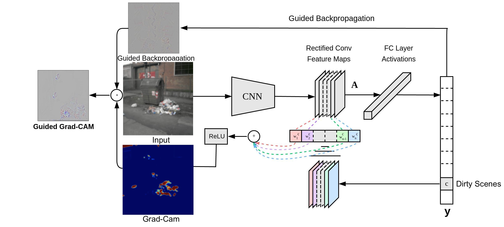

# ComputerVision_CleanDirty

During the first quarantine in 2020 neighbors were worried about the garbage in the Montevideo container. The main objective of this project is to implement an AI that understands if a street is dirty or clean and interpret the results in order to request the automatic maintenance of cleaning trucks in the dirtiest streets. A CNN algorithm is used to classify the dirty and clean streets, and the Grad-Cam algorithm is used in a second step to visualize the waste to better understand which pixels of that image have contributed to the final output  of  the  model. 

You can find the original Montevideo Container Dataset on Kaggle.

Dataset Clean dirty containers in Montevideo Kaggle link

## Clean/Dirty Classification with CNN
The architecture of our network is summarized above.  It contains eight learned layers — fiveconvolutional  and  three  fully-connected.   We’ll first add a convolutional 2D layer with 32 filters, akernel of 3x3, the input size as our image dimen-sions, 256x256, and the activation as ReLU. More details on the code.

https://github.com/naomiehl/ComputerVision_CleanDirty/blob/main/Classification.mov
Here is the result for an example panel found by the algorithm after 10 epochs for a batch size of 256

## Network interpretation with Grad-Cam 
In  this  section,   we’ll  show  how  we  interpretthe previous result usingClass Activation Maps(CAM), a powerful technique used in ComputerVision for classification tasks. It allows to inspectthe categorized image and understand which part-s/pixels of an image have contributed more to the final  output  of  the  model.

The Grad-CAM heat-map now emphasizes the dirt, and de-emphasizes the trash and the background. Overall, we have a much more precise region of emphasis that locates the dirt. We know that the model classifies this image as dirty due to its intrinsic features, not a general region in the image. The techniques presented here helped us to provide more transparency and create more trust in models throughout the improvement process.
